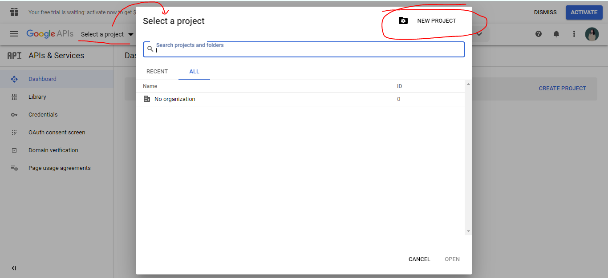

# Cont.

So each time when the page is refreshed, a cookie is saved n deleted --&gt; for this we are moving to the **LEVEL 6**

## \*\*\*\*🐞 **LEVEL 6**

\*\*\*\*👒 **Thirty Party OAuth - Open Authentication**

Access the third party websites ie &lt;&lt; **Login with Facebook ,GMail**&gt;&gt; to do this we have to knw about OAuth.

### STEPS

## 🐞 Log in with Google with the help of PASSPORT and OAUTH


[http://www.passportjs.org/docs/](http://www.passportjs.org/docs/)


Choose the latest version


[http://www.passportjs.org/packages/passport-google-oauth20/](http://www.passportjs.org/packages/passport-google-oauth20/)


**1.Create an Application**

Direct link is provided in Doc


[https://console.developers.google.com/apis/library?project=secret-299818&supportedpurview=project](https://console.developers.google.com/apis/library?project=secret-299818&supportedpurview=project)



[git://github.com/jaredhanson/passport-google-oauth2.git](git://github.com/jaredhanson/passport-google-oauth2.git)

[https://github.com/londonappbrewery/Authentication-Secrets](https://github.com/londonappbrewery/Authentication-Secrets)


For the full project, link the above 2nd link.

